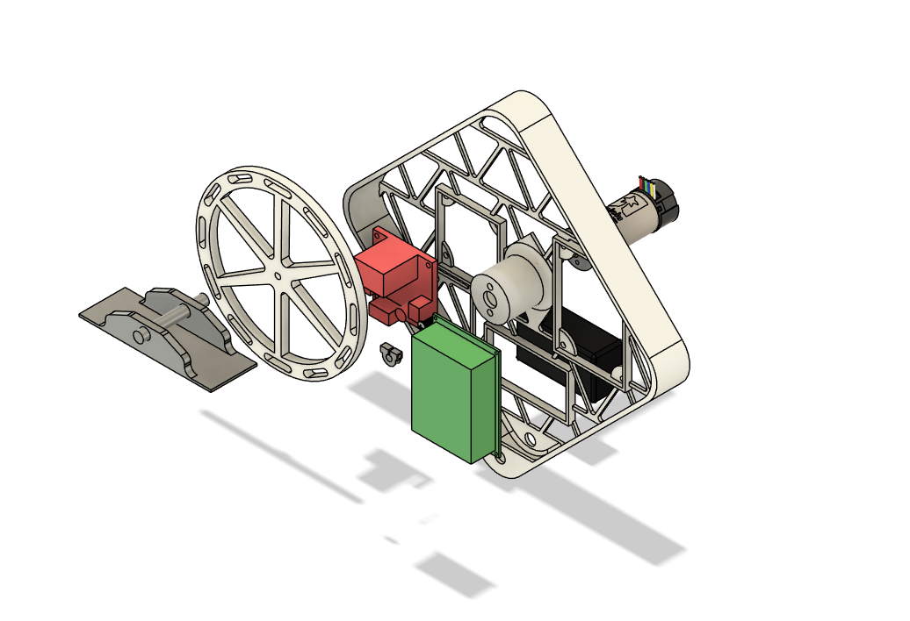
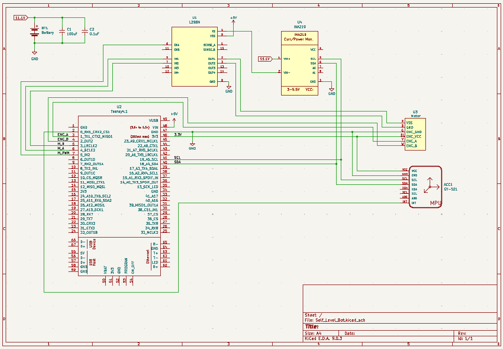

# Reaction Wheel Balancing Bot

This repository documents my attempt to build a reaction-wheel-based robot that can balance itself on one of its corners. The goal of this project was to apply and deepen my understanding of rigid body dynamics, control theory, and embedded systems through both simulation and physical implementation.

## Simulation

The simulation was done in Python using the `control` library. Key aspects include:

## Hardware

- **Microcontroller**: Teensy 4.1
- **Sensor**: GY521 (accelerometer + gyroscope)
- **Current Sensor**: INA219
- **Actuator**: Brushed DC motor with encoder
- **Reaction Wheel**: 3D-printed disc with wheel balacing weights 
- **Chassis**: 3D-printed frame with iterative design changes

## Future Goals

- Redesign the frame to better balance the center of mass
- Improve wheel symmetry and mass distribution to reduce vibration
- Implement sensor fusion (gyro + accelerometer) with a low-pass filter
- Experiment with a Kalman Filter for more accurate state estimation
- Continue tuning the LQR based on physical system performance
